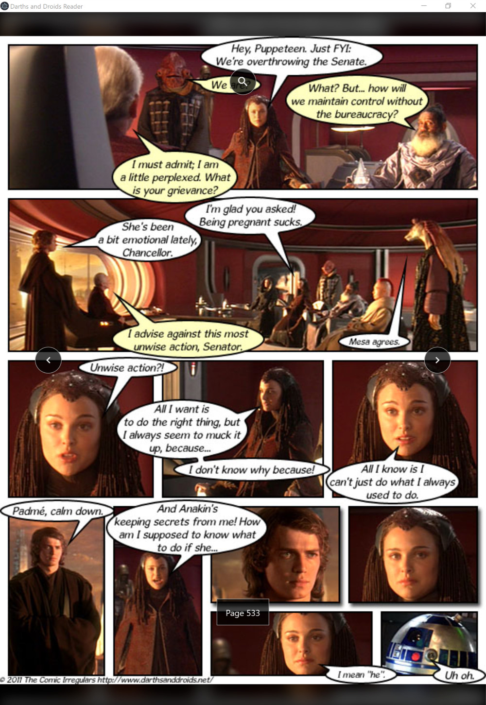
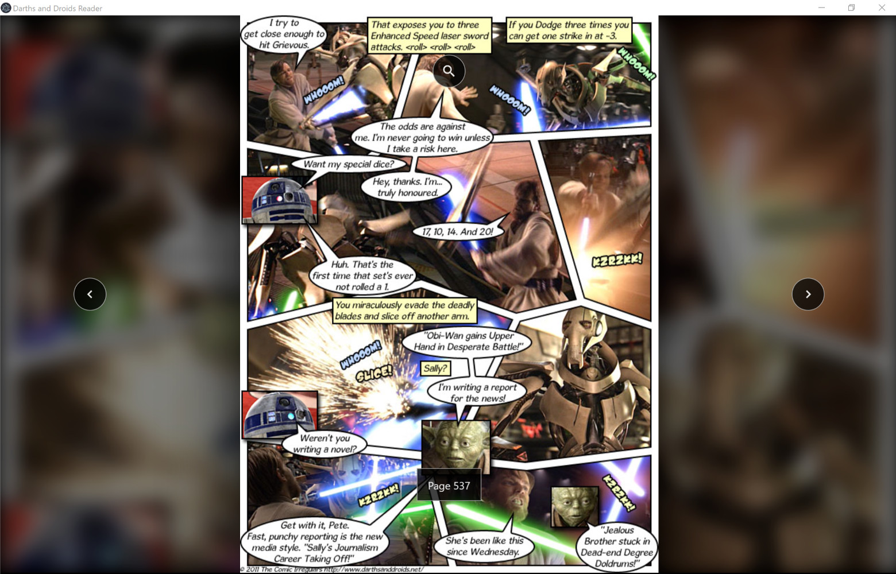

# Darths and Droids Reader

A simple reader application for the Darths and Droids [webcomic](http://www.darthsanddroids.net/).

The application was originally designed for the Microsoft Surface but is compatible with all screen sizes.

## Features

* provides support for touch, mouse and keyboard input
* allows you to continue where you last left off
* allows you to jump to specific pages
* automatically pulls new comics when available
* automatically resizes to any screen size (tablet and up is recommended)

## Screenshots

*Comic pages used with permission*

### Portrait

Portrait is the recommended orientation for tablets. Tapping or clicking on the comic will temporarily show on-screen controls.

The on-screen controls display the current page number (bottom), allow for pagination (left, right) and allow jumps to a specific page (top).

Pro tip: pagination can also be performed using touch swipes or the arrow keys on your keyboard!

### Landscape

The reader will automatically resize the comic to fit any screen size. Left over screen area is used to enhance the comic itself.

## Getting Started

The project is designed to run with or without [electron](https://electronjs.org/).

### Running with Electron

Use a prebuilt executable or build the project yourself.

### Running without Electron

Simply open `src/index.html` in your browser.

## Building with Electron

Run `npm i` to install dependencies. Please see the `scripts` section of `package.json` for available commands to build and run this project with electron.

### Prerequisites

* `node` with `npm` (https://nodejs.org/)
* `electron-forge` (https://electronforge.io)

## License

This project is licensed under the CC BY-NC-SA 4.0 license. See the [LICENSE](LICENSE) file for details.
